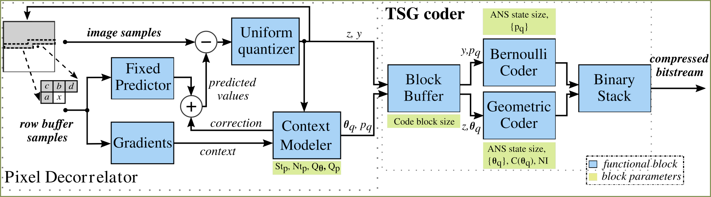
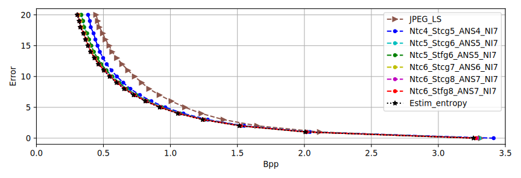
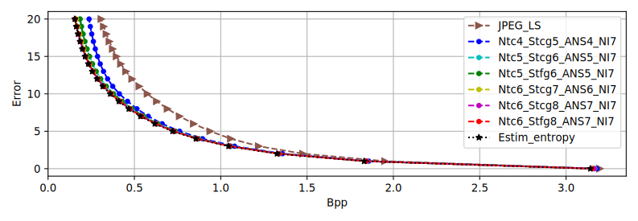
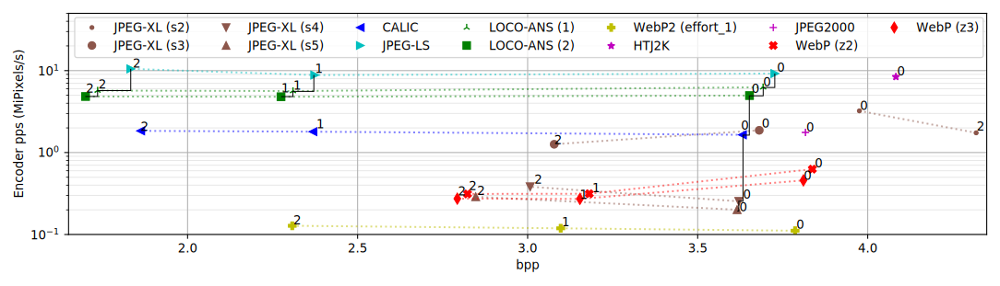
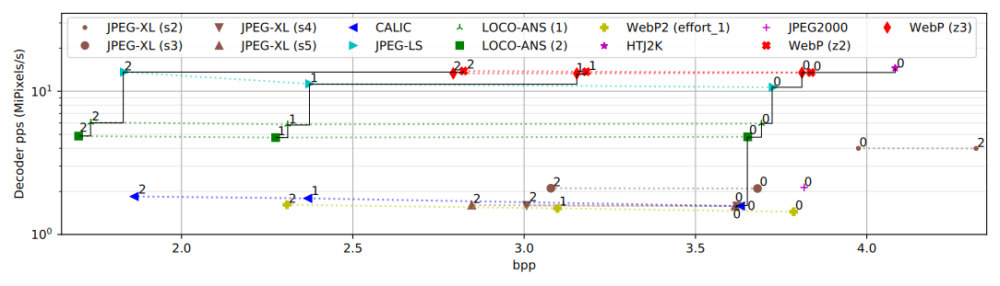

# LOCO-ANS CODEC 

This repository contains the source code resulting from the development of an ANS based coder for JPEG-LS.

In this work we propose enhancements to the JPEG-LS standard, aimed at improving its coding efficiency at a low computational overhead, particularly for hardware implementations. 
The main contribution is a low complexity and efficient coder, based on Tabled Asymmetric Numeral Systems (tANS), well suited for a wide range of entropy sources and with a simple hardware implementation. 
This coder enables further optimizations, resulting in great compression ratio improvements. When targeting photographic images,the proposed system is capable of achieving, in mean, 1.6%, 6% and 37.6% better compression for error tolerances of 0, 1 and 10, respectively. 
Additional improvements are achieved increasing the context size and image tiling, obtaining 2.3% lower bpp for lossless compression. 
Our results also show that LOCO-ANS compares favorably against state-of-the-art codecs like JPEG-XL and WebP, particularly in near-lossless, where it achieves higher compression ratios with a faster coding speed.

## Publication
This work has an associated publication (currently under revision):

Title: "LOCO-ANS: An optimization of JPEG-LS using an efficient and low complexity coder based on ANS"

Authors: Tobías Alonso, Gustavo Sutter, and Jorge E. López de Vergara

Submitted to IEEE Access

## Contents:
- codec: source code of LOCO-ANS codec
- notebooks: 
  - coder_config_gen.ipynb: Jupyter notebook to select coder parameters and generate the configuration file and tANS tables
- results_images
- Test: test code
- tools: auxiliary tools

## Test

A quick test can be run using the BASH script under the Test folder.
To run the test, the codec and auxiliary tools need to be built (run `make` in the repo root)

Prerequisites:
- [OpenCV C++ lib and dev files (any version >=2.4 should be fine)](https://opencv.org/releases/)

## Compression comparison vs JPEG_LS
Dataset: [Rawzor](https://imagecompression.info/test_images/)
Gray 8 bit images where used

Complete dataset:

Photographic images of the dataset:

## Speed-compression comparison

Dataset: [CLIC  images  subset](https://drive.google.com/drive/folders/1wMgmjf54iN46dVihvMnHhGk8oQT7a8Nd[49] )

### Encoder side

Average encoder MiPixels/s versus average bpp for software implementations of different compression algorithms. Numbers next to each point indicate the corresponding peak error. Pareto frontier is drawn with a solid line for error tolerances in [0,1,2]

### Decoder side 

Average decoder MiPixels/s versus average bpp for software implementations of different compression algorithms. Numbers next to each point indicate the corresponding peak error. Pareto frontier is drawn with a solid line for error tolerances in [0,1,2]
